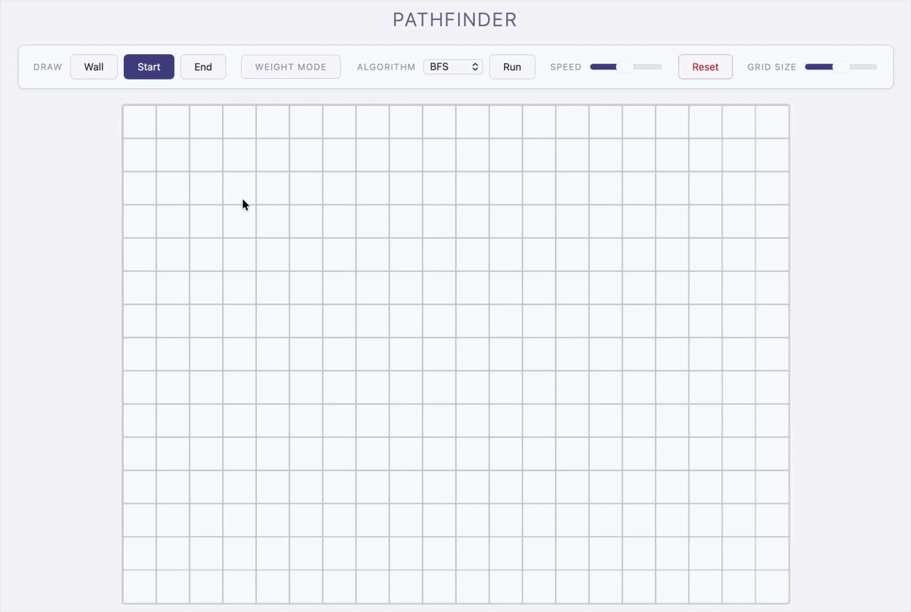

# Pathfinding Visualiser

Interactive visualiser for graph search algorithms, built from scratch in
TypeScript on HTML Canvas — no framework, no libraries.

**[Live demo →](https://pathfinding-visualiser-one.vercel.app)**



## What it does

Draw walls and weighted terrain onto a grid, pick an algorithm, and watch it
search. Nodes are coloured as they're visited, and the final path is traced
once the target is reached.

## Algorithms

| Algorithm | Weighted | Shortest path |
|---|---|---|
| Breadth-First Search | No | Yes (unweighted) |
| Depth-First Search | No | No |
| Dijkstra | Yes | Yes |

## Features

- Click-and-drag wall drawing, draggable start and target nodes
- Weighted terrain with configurable cost
- Adjustable animation speed
- [anything else — maze generation? clear/reset? add it here]

## Stack

TypeScript, HTML Canvas, deployed on Vercel.

## Running locally

```bash
git clone https://github.com/AriCohen1/pathfinding-visualiser.git
cd pathfinding-visualiser
npm install
npm run dev
```

## Notes

The grid is stored as [a flat array / 2D array] and the search runs
step-by-step through a [queue / priority queue], with each step pushed to an
animation buffer so the rendering stays decoupled from the algorithm itself.
